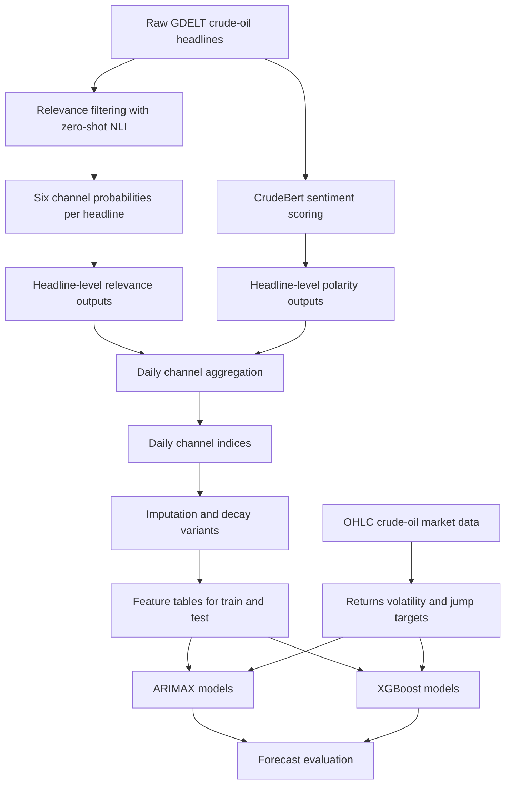

# Crude Oil Forecasting Engine

This repository contains the curated research code, selected artifacts, and documentation for a crude-oil forecasting pipeline built from news headlines and market data.

The core idea is:

1. collect crude-oil-related news headlines,
2. score each headline for market relevance and map it into six economically meaningful channels,
3. score headline sentiment,
4. aggregate those headline-level signals into daily indices,
5. test whether those indices improve crude-oil forecasting relative to price-history baselines.

## Research Goal

The project is designed to test whether richer news-derived features improve forecasting for crude oil. Instead of using a single sentiment score, the news signal is decomposed into six channels:

- Supply Shock and availability risk
- Transport logistics and chokepoints
- Demand and macro economy
- Inventory SPR and refinery
- OPEC producer policy
- Geopolitical Normalisation and Peace

These channels are then used as features in time-series and machine-learning models.

## Repository Structure

```text
scripts/
  01_data_collection/
  02_relevance_classification/
  03_sentiment_scoring/
  04_feature_engineering/
  05_modeling/

assets/
  crudebert/

notebooks/

artifacts/
  sample_inputs/
  model_inputs/
  derived_features/
  results/

docs/
```

## Pipeline Overview



### 1. Data Collection

The scripts in `scripts/01_data_collection/` retrieve daily GDELT news records for crude-oil-related keyword queries.

- `gdelt_yearly_downloader.py` is the main bulk downloader for year-by-year daily CSV retrieval.
- `gdelt_headlines.py` and `gdelt_json.py` provide JSON-based request variants.
- `gdelt_scraper.py` automates the GDELT UI with Playwright for CSV download through the web interface.

Primary output:

- daily raw headline files like `artifacts/sample_inputs/raw_headlines_2026-01-26.csv`

### 2. Relevance Classification

The scripts in `scripts/02_relevance_classification/` take raw headline CSVs and score them with zero-shot NLI.

- `relevance_scores_full_batch.py` is the main batch pipeline.
- `nli_single_file_probs.py` is the single-file version for spot runs and debugging.
- `scan_missing_files.py` checks for missing or undersized day files.

The relevance model produces:

- `prob_relevant`
- six per-channel relevance probabilities `p_<channel>`

Representative output:

- `artifacts/sample_inputs/relevance_scores_2026-01-26_nli_probs.csv`

### 3. Sentiment Scoring

The script in `scripts/03_sentiment_scoring/` runs a local BERT-based sentiment model called CrudeBert.

- `crudebert_batch_run.py` scores each headline as positive, negative, or neutral.
- `assets/crudebert/crude_bert_config.json` stores the model configuration used by that script.
- `notebooks/CrudeBert_Test.ipynb` is the exploratory notebook used to test loading and inference.

Important note:

The original workspace contained the model configuration and notebook, but the full binary weights file was not added here because it is large and not suitable for a lightweight code repository. The pipeline code still reflects how the model was used.

### 4. Feature Engineering

The scripts in `scripts/04_feature_engineering/` convert headline-level outputs into daily features.

- `step1_mass_thresholds.py` computes daily channel mass and estimates train-period evidence thresholds.
- `aggregate_daily_channel_index.py` aggregates headline-level relevance and polarity into daily channel indices.
- `impute_train_locf_cap5.py` applies low-evidence handling and capped LOCF imputation.
- `apply_decay.py` applies exponential decay smoothing to the channel series.
- `merge_sentiment.py` aligns daily global sentiment to returns data using `t-1` sentiment.
- `build_targets.py` creates market targets from OHLC data, including returns, Parkinson volatility, and jump flags.

Key daily aggregation logic:

- `mass_day(channel) = sum of relevance weights across headlines`
- `numerator_day(channel) = sum of relevance * polarity`
- `z_day(channel) = numerator / mass`

Included feature artifacts:

- `artifacts/derived_features/train_2017_2023_daily_channel_index.csv`
- `artifacts/derived_features/test_2024_2025_daily_channel_index.csv`
- `artifacts/derived_features/aux_2026_daily_channel_index.csv`
- `artifacts/derived_features/train_2017_2023_daily_channel_index_imputed_locf5.csv`
- `artifacts/derived_features/train_2017_2023_decayed_L10_lambda1_5.csv`

### 5. Modeling

The scripts in `scripts/05_modeling/` evaluate whether the engineered signals help forecasting.

#### ARIMAX

Located in `scripts/05_modeling/arimax/`.

- `arimax_price.py` runs price-only baseline models on multiple targets.
- `arimax_price_return.py` runs a return-only ARIMA baseline.
- `arimax_price_gsent.py` runs ARIMAX with lagged global sentiment as exogenous input.

Included result artifacts:

- `artifacts/results/arimax_price_summary_metrics.csv`
- `artifacts/results/arimax_return_summary_metrics.csv`
- `artifacts/results/return_arimax_with_sent_tminus1_report.json`

#### XGBoost

Located in `scripts/05_modeling/xgboost/`.

- `xgb_returns_hypothesis_runner.py` compares three scenarios:
  - lagged returns only
  - lagged returns plus global sentiment
  - lagged returns plus six channel indices

Included result artifacts:

- `artifacts/results/xgboost_metrics_summary.csv`
- `artifacts/results/shap_global_importance_returns_plus_global_polarity.csv`
- `artifacts/results/shap_global_importance_returns_plus_6channels.csv`

## Included Artifacts

This repository intentionally includes a representative subset of the original workspace so the research flow is understandable without carrying the full raw corpus.

### `artifacts/sample_inputs/`

Small examples of:

- a raw daily headline file,
- the corresponding NLI relevance output,
- a channel-labeled day-level export.

### `artifacts/model_inputs/`

Compact tabular inputs used by the downstream modeling scripts, including:

- price files,
- global sentiment files,
- target files,
- target files with lagged sentiment merged in.

### `artifacts/derived_features/`

Daily aggregated channel index files and processed variants used for train, test, and auxiliary periods.

### `artifacts/results/`

Selected model outputs and summary metrics showing the current empirical results.

## Current Findings

The included outputs suggest that the news-derived signals add only modest incremental forecasting value relative to price-history baselines.

### ARIMAX

From the included summary files:

- return-only ARIMA RMSE is approximately `0.016915`
- ARIMAX with lagged global sentiment improves slightly to approximately `0.016895`

### XGBoost

From `artifacts/results/xgboost_metrics_summary.csv`:

- lagged returns only RMSE is approximately `0.016994`
- lagged returns plus global sentiment RMSE is approximately `0.016977`
- lagged returns plus six channels RMSE is approximately `0.016977`

Interpretation:

- the six-channel design is methodologically useful and economically interpretable,
- the incremental predictive lift is currently small,
- the project is stronger as a research pipeline than as evidence of large forecasting gains.

## Running The Code

Most scripts were originally written as research utilities and expect file paths and parameters to be edited at the top of each file before execution.

Typical execution order:

1. run the data collection scripts
2. run relevance classification
3. run sentiment scoring
4. build daily channel indices and derived features
5. build market targets
6. run ARIMAX and XGBoost experiments

Because the scripts still contain environment-specific paths from the original workspace, they should be treated as research code rather than drop-in production software.

## Next Phase Of The Project

This repository reflects the mid-semester review stage of a semester-long machine learning course project. At the current stage, the pipeline for extracting news features, building six interpretable channels, and evaluating baseline forecasting models is already in place.

The next phase of the project is intended to focus more heavily on model development and stronger ML comparisons.

### Planned model extensions

The most relevant next models for this project are:

1. `LightGBM`
   A strong gradient-boosting baseline for structured tabular data. Since the current setup already uses lagged returns, global sentiment, and six channel features, LightGBM is a natural next model to compare directly against XGBoost.
2. `CatBoost`
   Another strong boosting model that is often very competitive on medium-sized tabular datasets. It is worth testing because the predictive signal here appears weak, and CatBoost sometimes handles small structured datasets more robustly than XGBoost.
3. `Regularized linear models`
   Ridge, Lasso, and Elastic Net are important next baselines. In weak-signal financial forecasting settings, simpler regularized models can perform surprisingly well and give cleaner interpretation than more complex methods.
4. `Support Vector Regression`
   SVR can be tested as a nonlinear alternative for return and volatility prediction once the feature set is stabilized.
5. `Regime-aware models`
   A useful next research direction is to allow the importance of the six news channels to vary across low-volatility and high-volatility market regimes. This can be approached through regime-switching models or by explicitly adding regime indicators into the ML pipeline.

### Possible advanced end-semester extensions

If time permits in the second half of the semester, the project can move beyond daily aggregated features and test richer models such as:

- sequence models on lagged daily features,
- attention-based models over headline-level embeddings before daily aggregation,
- transformer-style temporal models for multivariate forecasting.

These models are more advanced, but they will only be meaningful if the feature engineering and train-test protocol remain disciplined. For this project, stronger feature design and better temporal alignment are likely to matter at least as much as model complexity.

### Planned research improvements

The next empirical improvements are expected to come from:

1. building more feature variants from the six channels,
2. testing lag structures and rolling summaries of each channel,
3. comparing alternative daily aggregation choices,
4. evaluating whether the channels help more for volatility and jump prediction than for raw returns,
5. running broader model comparisons with walk-forward validation.

So the current status should be read as:

- mid-semester: feature extraction pipeline and baseline models are complete,
- end-semester goal: stronger ML model comparison and deeper analysis of whether news channels add predictive value.

## Dependencies

See `requirements.txt` for a practical package list inferred from the included code.
