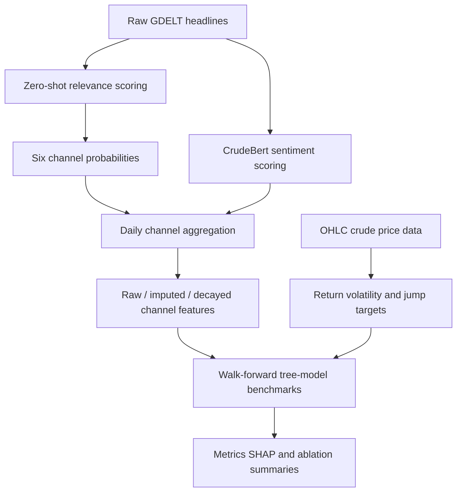

# Final Results Pack

This note collects the current pipeline story plus the outputs needed for the final review.

## Architecture



## Model Comparison Table

| Model | Target | RMSE | MAE | Notes |
|---|---:|---:|---:|---|
| ARIMA baseline | Return | 0.016915 | 0.012745 | order=(1, 0, 0) |
| ARIMAX price-only | target_return | 0.054191 | 0.034638 | order=(2, 0, 2) |
| ARIMAX price-only | target_vol_parkinson | 0.007337 | 0.005035 | order=(1, 0, 2) |
| ARIMAX jump baseline | target_jump_flag | - | - | acc=0.804494, F1=0.201835 |
| XGBoost single-split | baseline_returns_only | 0.016994 | 0.012801 | used_gpu=True |
| XGBoost single-split | returns_plus_global_polarity | 0.016977 | 0.012764 | used_gpu=True |
| XGBoost single-split | returns_plus_6channels | 0.016977 | 0.012763 | used_gpu=True |

## Best XGBoost Rows

Best-performing XGBoost scenario per task from `artifacts/results/tree_model_walkforward_xgboost_full/metrics_summary.csv`.

| Task | Best Scenario | Main Metric | Secondary Metric |
|---|---|---:|---:|
| return | `imputed_locf5_decay__single__demand_and_macro_economy` | RMSE=0.059099 | MAE=0.044174 |
| volatility | `raw_decay__single__opec_producer_policy` | RMSE=0.007516 | MAE=0.005480 |
| jump | `imputed_locf5_decay__single__opec_producer_policy` | PR_AUC=0.721831 | F1=0.623377 |

## Best LightGBM Rows

Best-performing LightGBM scenario per task from `artifacts/results/tree_model_walkforward_lightgbm_full/metrics_summary.csv`.

| Task | Best Scenario | Main Metric | Secondary Metric |
|---|---|---:|---:|
| return | `imputed_locf5_decay__single__demand_and_macro_economy` | RMSE=0.059484 | MAE=0.044965 |
| volatility | `raw__market_only` | RMSE=0.007947 | MAE=0.006056 |
| jump | `imputed_locf5_decay__single__opec_producer_policy` | PR_AUC=0.729594 | F1=0.733945 |

## Best CatBoost Rows

Best-performing CatBoost scenario per task from `artifacts/results/tree_model_walkforward_catboost_full/metrics_summary.csv`.

| Task | Best Scenario | Main Metric | Secondary Metric |
|---|---|---:|---:|
| return | `raw__market_plus_all6_channels` | RMSE=0.057499 | MAE=0.043308 |
| volatility | `raw_decay__single__opec_producer_policy` | RMSE=0.007617 | MAE=0.005705 |
| jump | `imputed_locf5_decay__market_plus_all6_channels` | PR_AUC=0.749896 | F1=0.704545 |

## SHAP Figure

Latest bar-summary figure: `artifacts/results/tree_model_walkforward_best_shap/catboost_return/shap_summary_bar__catboost__return__raw__market_plus_all6_channels.png`

## Deck Assets

- Comparison table PNG: `docs/assets/final_results/final_comparison_table.png`
- Architecture diagram PNG: `docs/assets/final_results/architecture_diagram.png`
- Example day PNG: `docs/assets/final_results/example_day_2026-01-26.png`
- SHAP manifest CSV: `docs/assets/final_results/shap_manifest.csv`

## Ablation Coverage

The benchmark runner defines these experiment families:

- `market_only`
- `market_plus_global_sentiment`
- `market_plus_top3_channels`
- `market_plus_all6_channels`
- six single-channel ablations
- channel variants: `raw`, `raw_decay`, `imputed_locf5`, `imputed_locf5_decay`
- model families: `xgboost`, `lightgbm`, `catboost`

## Example Day: 2026-01-26

### Headline Samples

- `2026-01-26 12:30:00`: Oil prices hold gains amid geopolitical tensions , supply concerns \| Hellenic Shipping News Worldwide
- `2026-01-26 05:00:00`: Oil little changed as supply concerns temper US winter output disruptions
- `2026-01-26 04:00:00`: Oil little changed as supply concerns temper US winter output disruptions

### Relevance / Channel Mapping

| Title | prob_relevant | strongest channel |
|---|---:|---|
| Oil prices hold gains amid geopolitical tensions , supply concerns \| Hellenic Shipping New | 0.994734 | Supply Shock and availability risk |
| Oil little changed as supply concerns temper US winter output disruptions | 0.992085 | Supply Shock and availability risk |
| Oil prices slip slightly after strong gains ; geopolitical tensions remain – Oil & Gas 360 | 0.995479 | Supply Shock and availability risk |
| Oil steady amid supply worries and distruptions | 0.990687 | Supply Shock and availability risk |
| Chinese , Greek shipping companies resume Suez Canal transits | 0.954180 | Transport logistics and chokepoints |

### Daily Index Snapshot

| Channel | z_day | low_evidence |
|---|---:|---:|
| Supply Shock and availability risk | 0.148547 | 0.000000 |
| Transport logistics and chokepoints | 0.417522 | 0.000000 |
| Demand and macro economy | 0.318550 | 0.000000 |
| Inventory SPR and refinery | -0.118669 | 0.000000 |
| OPEC producer policy | -0.288990 | 0.000000 |
| Geopolitical Normalisation and Peace | 0.502676 | 0.000000 |

## How To Regenerate

```bash
python3 -m venv .venv-bench
.venv-bench/bin/pip install -r requirements-benchmark.txt
python scripts/05_modeling/boosting/tree_walkforward_benchmark.py --scenario-set full
python scripts/05_modeling/xgboost/xgb_walkforward_multitask.py --scenario-set full
python scripts/06_reporting/build_final_results_report.py
```

## Notes

- The walk-forward runner uses repo artifacts rather than the old external XLSX paths.
- News features are lagged by one day before merging into market targets.
- Jump experiments are handled as binary classification with probability outputs and PR-AUC/F1 reporting.
- The multi-model benchmark uses the same folds and scenarios for XGBoost, LightGBM, and CatBoost.
